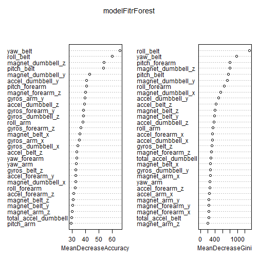

Practical Machine Learning (PML) - Project
==========================================

Overview
--------

1. Getting and cleaning data
2. Model building: Cross validation
3. Model building: Predicting results
4. Result submission

1. Getting and cleaning data
----------------------------

First step: setting the work directory and loading the required packages: caret and random forests.
Second step: setting the seed.

The r command bellow for training and testing showed that some columns should be skipped, containing NAs, invalid content like strings and other columns.
```
summary(training_original)
summary(testing_original)
```

In the end the colsSkip object was built to contain all column names to delete from both data sets.

```
training <- training_original[, !(names(training_original) %in% colsSkip)]
#summary(training)
trainingCols <- names(training)
testing <- testing_original[,names(testing_original) %in% trainingCols]
#summary(testing)
```

3. Model building: Cross validation
-------------------
Considering the predictors we were introduced, I've decided to use random forests. One of the reasons that I decided to used it is because I probably will study it more to see if it can help me classifying some data extra MOOC.
My major goal was 1st to try using this predictor and by evaluating its performance and by checking the confusion matrix as well as other sub products, I expected to confirm that it can be used to predict the quiz's required output submission.
To perform the cross validation I've splited the training dataset into 2 datasets, 60% vs 40 % for training and testing.

```
#building "training" and "testing" subset from the training data set.
trainingSubSet <- createDataPartition(y=training$classe, p=0.6, list=FALSE)
trainingTrainSubSet <- training[trainingSubSet, ]
trainingTestSubSet <- training[-trainingSubSet, ]
```

Then, I tried to run the predictor with the random forests detault parameters to access its quality.

```
#compute training using random forests.. and predict
trainingSubSetRF <- randomForest(classe~., data= trainingTrainSubSet)
trainingTestSubSetPR <- predict(trainingSubSetRF, trainingTestSubSet)
```

Later, by building the confusion matrix, I got the following results...


```r
trainingConfTable <- confusionMatrix(trainingTestSubSetPR, trainingTestSubSet$classe)
trainingConfTable
```

```
## Confusion Matrix and Statistics
## 
##           Reference
## Prediction    A    B    C    D    E
##          A 2232    4    0    2    0
##          B    0 1511   10    1    0
##          C    0    3 1358   17    2
##          D    0    0    0 1265    2
##          E    0    0    0    1 1438
## 
## Overall Statistics
##                                           
##                Accuracy : 0.9946          
##                  95% CI : (0.9928, 0.9961)
##     No Information Rate : 0.2845          
##     P-Value [Acc > NIR] : < 2.2e-16       
##                                           
##                   Kappa : 0.9932          
##  Mcnemar's Test P-Value : NA              
## 
## Statistics by Class:
## 
##                      Class: A Class: B Class: C Class: D Class: E
## Sensitivity            1.0000   0.9954   0.9927   0.9837   0.9972
## Specificity            0.9989   0.9983   0.9966   0.9997   0.9998
## Pos Pred Value         0.9973   0.9928   0.9841   0.9984   0.9993
## Neg Pred Value         1.0000   0.9989   0.9985   0.9968   0.9994
## Prevalence             0.2845   0.1935   0.1744   0.1639   0.1838
## Detection Rate         0.2845   0.1926   0.1731   0.1612   0.1833
## Detection Prevalence   0.2852   0.1940   0.1759   0.1615   0.1834
## Balanced Accuracy      0.9995   0.9968   0.9946   0.9917   0.9985
```

```r
trainingConfTableAll <- confusionMatrix(trainingTestSubSetPR, trainingTestSubSet$classe)$overall
trainingConfTableAll
```

```
##       Accuracy          Kappa  AccuracyLower  AccuracyUpper   AccuracyNull 
##      0.9946470      0.9932281      0.9927711      0.9961394      0.2844762 
## AccuracyPValue  McnemarPValue 
##      0.0000000            NaN
```

The model results above, provided me an idea that it had a good enough accuracy, so it was time to use that with the testing dataset.

3. Model building: Predicting results
-----------------
The main idea was to use all training data set with the same model parameters against the testing dataset and check if it could predict the testing classe.
The random forest model was built like shown bellow as well as its full outputs.


```r
#build model using random forests..
modelFitrForest <- randomForest(classe ~ ., data = training, importance = T)
modelFitrForest
```

```
## 
## Call:
##  randomForest(formula = classe ~ ., data = training, importance = T) 
##                Type of random forest: classification
##                      Number of trees: 500
## No. of variables tried at each split: 7
## 
##         OOB estimate of  error rate: 0.23%
## Confusion matrix:
##      A    B    C    D    E  class.error
## A 5578    1    0    0    1 0.0003584229
## B    7 3787    3    0    0 0.0026336582
## C    0   10 3411    1    0 0.0032144944
## D    0    0   19 3196    1 0.0062189055
## E    0    0    0    2 3605 0.0005544774
```

From it, I got the features variance of importance which I've plotted.


```r
#get the features variance of importance... 
modelFitrForestVarImpObj <- varImp(modelFitrForest)
#and plot it...
varImpPlot(modelFitrForest, sort=TRUE)
```

 

The figure above shows which measures are more important to predict the test case classe measure.
Using that model parameters, the predicted results were obtained next.


```r
resultrForest <- predict(modelFitrForest, testing)
```

#INCLUIR E DEPOIS APAGAR: 
#Describe what they expect the out of sample error to be and estimate the error appropriately with cross-validation?

4. Result submission
--------------------

My classifier correctly predicted 20/20 test sample classes.

```r
resultrForest
```

```
##  1  2  3  4  5  6  7  8  9 10 11 12 13 14 15 16 17 18 19 20 
##  B  A  B  A  A  E  D  B  A  A  B  C  B  A  E  E  A  B  B  B 
## Levels: A B C D E
```

```r
pml_write_files(resultrForest)
```
